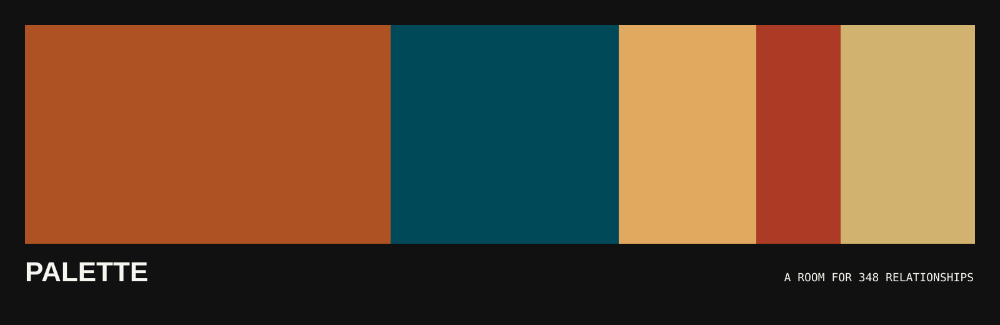

# Palette

[Type & context](https://colors.nonarkara.org/reading#typography) adds Dr Non's
Bringhurst interpretation to the reading room. [Download the self-contained
typography guide](TYPOGRAPHY-FIELD-GUIDE.md) or use the
[portable skill and source ledger](skills/bringhurst-contextual-type/SKILL.md).
Choose for task, text, medium and script—not a fashionable font pairing.



Palette turns Sanzo Wada's 348 colour combinations into an interactive room.
The current combination fills the screen. Search changes the room by colour,
temperature, energy, medium, or intended use. A black instrument rail holds the
few controls needed to move, search, compare, copy, and read.

Come with an idea or without one. Type a mood, colour, place, material, or use;
choose one of the starting moods; or let chance open a room. When a relationship
feels right, choose **COPY THIS FOR YOUR AGENT**. Palette copies a complete brief
with named CSS tokens, production roles, unequal proportions, accessibility
instructions, attribution, and a stable reference link. Paste it into any coding
agent and start building.

**Live exhibition:** <https://colors.nonarkara.org/>

**GitHub Pages mirror:** <https://nonarkara.github.io/palette/>

**Design reading room:** [Made for someone](reading.html). Bauhaus-informed
composition, communication, modern web standards and observable usability.
Download [the self-contained design guide](DESIGN-FIELD-GUIDE.md), or give your
agent [the reusable skill](skills/bauhaus-human-design/SKILL.md) with its two
references. This first synthesis is based on selected close readings—not a
completed reading of all five books. The [ledger](skills/bauhaus-human-design/references/reading-ledger.md)
records exact coverage, upstream commits, licences and remaining work.

**Wallpapers:** choose `↓` on any plate. Download a PNG for phone (1440 × 3120),
iPad/tablet (2048 × 2732), or computer (3840 × 2160). Keep colour names, hex values
and credits, or turn the labels off for plain fields. Generation stays on your
device. Portrait palettes stack vertically; desktop palettes sit side by side.

**Search:** try `calm ocean`, `red and black`, `minimalist website`, `สีแดงสีดำ`,
`红色黑色`, a hex value, or a plate number. Curated synonyms and light spelling
tolerance expand discovery. Exact all-term matches lead; otherwise the finder
labels partial matches as related. Unknown words can still return no matches;
there is no remote model pretending to understand everything.

**Use it immediately:** download
[`PALETTE-FIELD-GUIDE.md`](PALETTE-FIELD-GUIDE.md) for the controls, fork recipe,
palette-role method, accessibility gate, and attribution boundary in one file.

## The idea

Colour books often become grids of small swatches. The grid is useful and keeps
the body at a distance. Palette removes that distance. Each combination becomes
architecture for one screen.

Wada's catalogue treats colour as relationship. A colour changes beside another
colour, and it changes again when its share of the field becomes smaller. This
edition keeps that idea and makes the proportions deliberately unequal. Two
colours divide the room at roughly 61.8 / 38.2. Trios and quartets retain one
dominant field, then compress the supporting colours.

The site is an independent interpretation. It does not reproduce scans, cover
art, publisher copy, or printed colour claims.

## How the room works

| Symbol | Action | Keyboard |
|---|---|---|
| `←` | Previous relationship | Left arrow |
| `→` | Next relationship | Right arrow |
| `↻` | Chance encounter | `R` |
| `⌕` | Search names, readings, and uses | `/` |
| `≡` | Complete index and 2/3/4-colour filters | `G` |
| `◐` | Grayscale value study | `C` |
| `A` | Dr Non, the research, and the system architecture | `A` |
| `{}` | Inspect and copy portable JSON for the current plate | `J` |
| `⧉` | Copy an agent-ready palette brief | — |
| `i` | Principles, provenance, and Dr Non's Digest | `I` |

Actions are real buttons; the `Aa` reading-room destination is a same-tab link.
Every state change is announced to assistive
technology. Colour names, plate numbers, and text readings remain available, so
colour is never the only carrier of information.

The visible **COPY THIS FOR YOUR AGENT** action and the `⧉` instrument copy the
same concise implementation brief: named CSS variables, suggested roles and
proportions, contrast instruction, source boundary, licence, and stable plate
URL. It is designed to be pasted directly into any coding agent.

The `{}` instrument opens a readable JSON export for the current plate. It
includes the named colours, RGB and hex conversions, actual field proportions,
role suggestions, computed reading, provenance, an agent-ready prompt, and a
stable plate URL. Copy it
into code, a design tool, an agent brief, or another project without scraping
the screen.

## Dr Non's Digest

> A colour is not a property. It is an event between surfaces.

The phrase “natural gastronomy” is useful here. Appetite is relational: salt
changes fruit; bitterness gives sugar an edge; temperature changes texture.
Colour behaves in a similar way. The eye wants tension, rest, temperature, and
proportion. Harmony does not mean that every colour agrees. A good combination
keeps a small disagreement alive.

The application computes a plain reading for every plate:

- temperature: warm-led, cool-led, or warm–cool tension;
- energy: quiet, clear, or electric;
- value interval: close, measured, or high contrast;
- possible room: editorial, civic, domestic, botanical, archival, musical, or spatial.

These readings are original editorial metadata. They are deterministic and run
inside the browser. They are not claims made by Wada and do not call an AI API.

## About and research

The `A` instrument opens Dr Non's personal colour interval—Red and Black,
classy and dangerous—alongside the research position behind the exhibition.
Two Bauhausian diagrams make the argument visible: architecture, anthropology,
and civic systems converge on a test of legibility; then source data passes
through deterministic method and application state before becoming the room.
The Red / Black study is explicitly personal and is not presented as one of
Wada's historical combinations.

The same room now includes a dedicated tribute to Sanzo Wada (1883–1967),
placing the colour dictionary inside his wider life as painter, teacher,
researcher, kimono and costume designer, printmaker, and film colour director.
A documented five-part chronology connects *South Wind*, the Japan Standard
Color Association, *Haishoku Sōkan*, *Gate of Hell*, and his recognition as a
Person of Cultural Merit. The section uses the source-verified Yellow Orange / Dark
Tyrian Blue relationship from Plate 002 and links directly to institutional
records rather than treating attribution as decoration.

## Interpretation and authorship

This site is **Dr Non Arkaraprasertkul’s independent interpretation of Sanzo
Wada’s work**. Wada supplies the documented historical colour names,
relationships, and research lineage. Dr Non supplies the selection, spatial
proportions, interface, search vocabulary, colour roles, diagrams, prose, and
deterministic readings of temperature, energy, value, and possible use.

Those readings are not Wada’s words or intentions. The RGB and hex values are
credited digital conversions rather than measurements of printed ink. The
About room carries a six-part curatorial register and colophon so this boundary
travels with the exhibition instead of living only in repository documentation.
JSON exports repeat the same interpretation credit for downstream use.

## Three languages, one argument

The principles are written in English, Thai, and Simplified Chinese. The three
texts carry the same argument but are typeset for their own scripts:

- Archivo Narrow for the exhibition instrument;
- IBM Plex Sans Thai for non-looped modern Thai, with room for tone marks;
- Noto Sans SC for region-correct Simplified Chinese;
- JetBrains Mono only for plate numbers and digital values.

## Design law

The page follows four references: Wada's plates, Rothko's scale, Bauhaus
geometry, and MoMA's object-first exhibition hierarchy. The result is governed
by a short contract:

1. One source-verified combination owns the viewport.
2. The interface behaves like museum hardware.
3. No rounded corners, gradients, drop shadows, visible borders, custom cursors, or decorative texture.
4. Grouping comes from position, scale, negative space, and solid fields.
5. Motion confirms a plate change and stops within 280 milliseconds.
6. Digital values are conversions. Printed ink remains its own object.

When these laws disagree, apply [`CONFLICT-ORDER.md`](CONFLICT-ORDER.md) in the order written there.
Read [`context.md`](context.md) for the full design contract.
Read [`ABOUT.md`](ABOUT.md) for the curatorial argument and
[`JOURNAL.md`](JOURNAL.md) for the build record. The latest structured usability
pass is recorded in
[`docs/walkthroughs/2026-10-02-blueprint.md`](docs/walkthroughs/2026-10-02-blueprint.md).

## Data and provenance

The repository includes 159 named colours that reconstruct 348 combinations of
two, three, and four colours. The digital data comes from Matt DesLauriers'
MIT-licensed
[`dictionary-of-colour-combinations`](https://github.com/mattdesl/dictionary-of-colour-combinations),
which credits Dain M. Blodorn Kim's earlier interactive compilation. The historic
combinations are credited to Sanzo Wada.

RGB and hex values are colour-managed conversions supplied by the dataset. They
may differ from the printed book. See [`THIRD_PARTY_NOTICES.md`](THIRD_PARTY_NOTICES.md)
for the full notice.

## Architecture

The exhibition has no framework and no backend:

```text
index.html          semantic structure, dialogs, multilingual essay
styles.css          field geometry, typography, motion, responsive rules
app.js              palette reconstruction, search, readings, navigation
content.js          search vocabulary and editorial-use modules
PALETTE-FIELD-GUIDE.md  standalone download-and-use handbook
CONFLICT-ORDER.md   precedence when the design rules disagree
data/colors.json    credited MIT-licensed source data
tests/              source integrity and anti-slop checks
.github/workflows/  verification and GitHub Pages publication
DEPLOYMENT.md       Cloudflare/GitHub release topology and proof sequence
```

Search and classification run locally. No account, analytics service, cookie,
database, or remote model is involved.

## Run it

```bash
npm run dev
```

Open `http://localhost:4173`. Directly opening `index.html` will not load the JSON
dataset because browsers block local file requests.

## Verify it

```bash
npm run check
```

The checks prove that the source still contains 159 unique colours and all 348
plates, that every plate has two to four colours, and that the interface retains
its multilingual, accessibility, provenance, and anti-slop invariants.

Automated checks cannot judge the room. Before a release, also test:

- keyboard-only navigation;
- 200% zoom;
- widths of 375, 768, and 1280 pixels;
- reduced-motion mode;
- search in English, Thai, and Chinese;
- the deployed GitHub Pages URL, not only localhost.

## Status

This is an initial public edition built by Dr Non Arkaraprasertkul with Codex.
It is independent and has no affiliation with Seigensha, the Wada estate, or
the upstream data authors. Automated and structured browser gates pass. The
real-human Mama Rule remains a release gate for a future `1.0` tag; this public
edition is deliberately numbered `0.1.0` until that first-time-user test occurs.

Code and original writing: **MIT licensed—use it, fork it, change it, and ship
your own version.** Source data: upstream MIT terms retained. Preserve the
attribution and digital-conversion caveats recorded in `THIRD_PARTY_NOTICES.md`.
